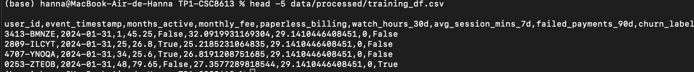
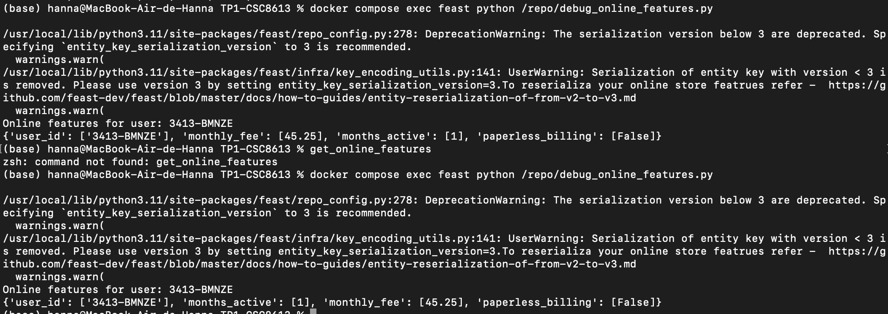
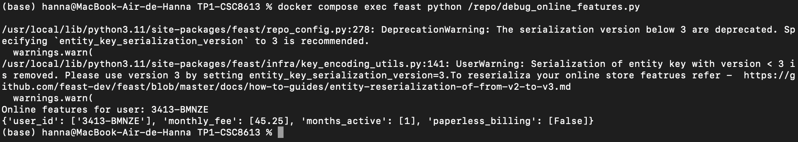
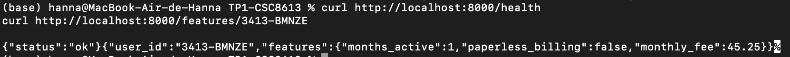

# Contexte
Nous disposons déjà des données StreamFlow chargées dans PostgreSQL, notamment des snapshots mensuels pour deux périodes (month_000 et month_001) construits au TP2 : profil d’abonnement (`subscriptions_profile_snapshots`), usage agrégé (`usage_agg_30d_snapshots`), paiements (`payments_agg_90d_snapshots`) et support (`support_agg_90d_snapshots`), ainsi qu’une table de labels (`labels`) et les tables métier (utilisateurs, etc.).  
L’objectif du TP3 est de brancher ces snapshots à un Feature Store (Feast) afin de récupérer des features en mode offline pour construire un dataset d’entraînement churn, puis de matérialiser et servir les mêmes features en online. Enfin, on expose un endpoint API minimal qui interroge Feast pour renvoyer les features d’un utilisateur, afin de préparer le serving en production.

# Mise en place de Feast
Commande de démarrage :
docker compose up -d --build

Le conteneur `feast` embarque Feast et sert à exécuter les commandes du Feature Store. La configuration est montée dans le conteneur dans `/repo` (depuis `./services/feast_repo/repo`) et le fichier principal est `/repo/feature_store.yaml`.  
On utilisera ensuite `docker compose exec feast ...` pour lancer `feast apply` (création/MAJ du registry) et `feast materialize` (remplissage de l’online store).

# Définition du Feature Store
a) Entity + user_id
Dans Feast, une *Entity* représente l’objet métier sur lequel les features sont définies et jointes (ex : utilisateur).  
Dans StreamFlow, `user_id` est une clé de jointure naturelle car toutes les tables de snapshots (abonnement, usage, paiements, support) sont agrégées au niveau utilisateur et partagent cette colonne.

b)Exemple snapshot + features
La table `usage_agg_30d_snapshots` contient notamment `watch_hours_30d`, `avg_session_mins_7d`, `unique_devices_30d`, `rebuffer_events_7d` (ainsi que `user_id` et `as_of`).

c)À quoi sert feast apply
`feast apply` enregistre la définition du Feature Store (Entities, DataSources, FeatureViews) dans le *registry* Feast (`registry.db`).  
Le registry sert de source de vérité : il décrit quelles features existent, leur schéma, leurs sources (offline/online) et comment Feast doit les servir.

# Récupération offline & online
Commande :
docker compose exec prefect bash -lc "cd /opt/prefect/flows && python build_training_dataset.py"

Feast garantit la *point-in-time correctness* grâce au `timestamp_field="as_of"` défini dans chaque DataSource : les features sont datées et ne peuvent être récupérées que pour un instant donné.  
Lors de `get_historical_features`, le `entity_df` fournit (`user_id`, `event_timestamp`) et Feast joint automatiquement les valeurs correspondant à cet instant, évitant d’utiliser des informations futures par rapport à la date de référence.

Si on interroge un user_id sans features matérialisées (inexistant ou hors fenêtre), Feast renvoie des valeurs None/absentes pour les features demandées car l’online store ne contient pas d’entrée correspondante.
Commandes:
curl http://localhost:8000/health
curl http://localhost:8000/features/3413-BMNZE

# Réflexion
L’endpoint `/features/{user_id}` basé sur Feast réduit le training-serving skew car les features servies en production proviennent des mêmes FeatureViews que celles utilisées offline pour construire le dataset d’entraînement.  
On centralise la définition des features (noms, types, sources, logique temporelle) au même endroit et on évite de recoder des transformations différentes côté training et côté serving.  
Ainsi, le modèle voit des features cohérentes entre entraînement et production, ce qui diminue les écarts de distribution et les erreurs de pipeline.
