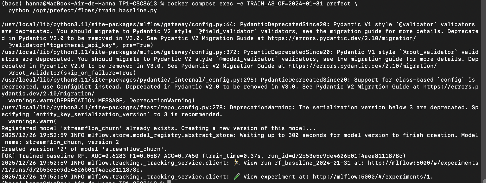
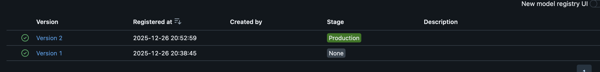
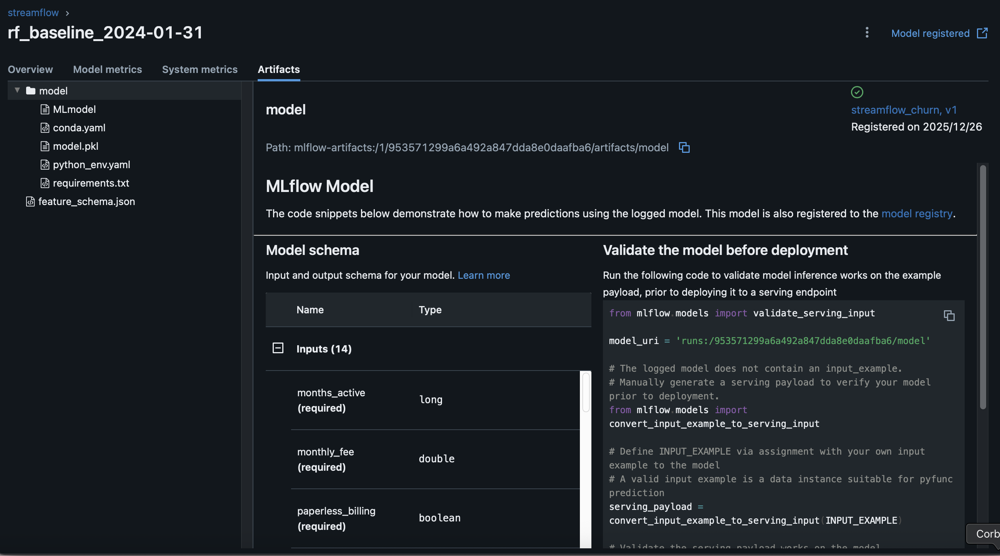
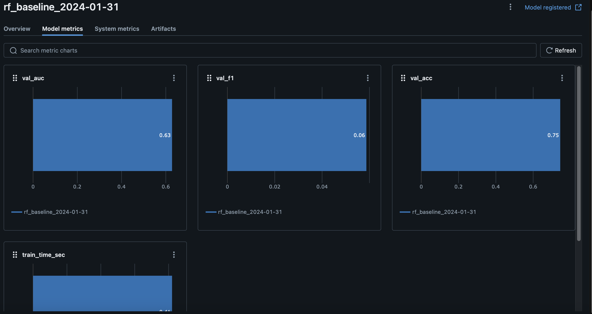
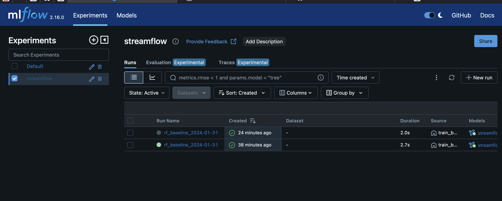
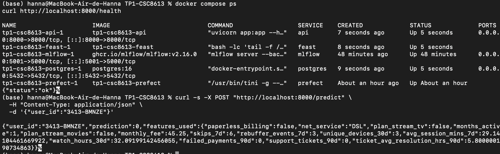
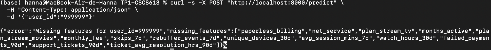

# Mise en route + sanity checks
La stack fait tourner PostgreSQL (données + stores), Feast (Feature Store + registry + online store), Prefect (scripts batch offline), l’API FastAPI (exposition /health, /features, puis /predict), et MLflow (tracking + model registry + artefacts).  
MLflow centralise les runs (params/métriques/artefacts) et le Model Registry pour piloter quelle version est servie en Production.

# Entraînement + tracking MLflow (baseline)
Run MLflow créé : run_id=d72b53e5c9de4626b01f4aea8111878c
Métriques :
AUC = 0.6283
F1 = 0.0587
ACC = 0.7450
train_time = 0.37s
Model Registry :
modèle streamflow_churn
version 2 créée (“Created version '2' ...”)

AS_OF : on fige une date des données. Comme ça, à chaque rerun on récupère exactement le même état (pas de données du futur, pas d’écart si la base a changé) et les résultats restent comparables/auditables.

random_state : on fixe l’aléatoire (split, shuffle, init, subsampling…). Sinon deux runs identiques peuvent donner des jeux d’entraînement et des scores différents. Avec une graine, c’est reproductible et plus facile à debugger.

# Promotion dans le Model Registry

Version en prod: 2 

La promotion via une interface (None → Staging → Production) est **traçable** : on sait quelle version est déployée, quand et par qui.
Elle limite les erreurs humaines (mauvais fichier/chemin local) et évite le “ça marche sur mon PC”.
Elle standardise le passage en prod (tests, validations, rollback) et rend le déploiement **reproductible** entre environnements.
Enfin, elle s’intègre naturellement à la CI/CD et à l’audit/conformité.

# API /predict + robustesse

Le modèle chargé par l’API doit pointer vers models:/streamflow_churn/Production car cela découple le serving d’un fichier local et centralise la “source of truth” dans le Model Registry. Le stage Production désigne explicitement la version autorisée à être servie, ce qui permet de changer de modèle (promotion/démotion) sans modifier le code ni redéployer l’API. En plus, MLflow garantit la traçabilité : on sait exactement quel run, quels paramètres, quelles métriques et quels artefacts correspondent à la version servie. À l’inverse, un .pkl local est fragile (chemins, copies, divergence entre environnements) et peu auditables. Un artifact de run pointe vers une version “figée” mais non gouvernée : il n’y a pas de notion de stage ni de validation, donc risque de servir un modèle non approuvé. Avec le Registry, on standardise le cycle de vie du modèle et on réduit les erreurs de déploiement.

En serving, beaucoup d’échecs ne viennent pas du modèle mais des features. D’abord, si l’entité est absente (ex : user_id inexistant dans l’online store), Feast ne trouve aucune valeur matérialisée et renvoie des features nulles, ce qui provoque une erreur contrôlée côté API (“missing_features”). Ensuite, même pour un utilisateur réel, l’online store peut être incomplet ou obsolète (materialize non exécuté, fenêtre de matérialisation incorrecte, ou données “stale”) : certaines features manquent ou ne sont pas à jour, ce qui se détecte tôt via des checks de valeurs nulles et de schéma. Ces garde-fous évitent de renvoyer une prédiction basée sur des entrées partielles ou incohérentes, et rendent l’erreur explicite et actionnable.

# Réflexion

MLflow apporte deux garanties clés dans ce pipeline. D’abord, il sert de “journal de bord” des entraînements : pour chaque run, on retrouve les paramètres (AS_OF, hyperparamètres…), les métriques (AUC/F1/ACC) et les artefacts (par ex. le schéma des features), ce qui rend les comparaisons propres et l’audit possible sans ambiguïté. Ensuite, il sécurise l’identification du modèle servi via le Model Registry : on versionne le modèle (v1, v2, …) et chaque version pointe vers un run précis, avec le contexte complet (code, paramètres, métriques) associé.

Le stage Production signifie concrètement que l’API ne va pas “pêcher un fichier” quelque part, mais charger la version officiellement validée. Au démarrage, elle résout models:/streamflow_churn/Production vers la version actuellement taggée Production, puis la charge. Résultat : on peut faire évoluer le modèle servi en changeant uniquement le stage dans l’UI, sans toucher au code ni rebuild les images Docker, tout en évitant qu’un modèle local non validé parte en prod “par accident” (il faut passer par la promotion).

Même avec MLflow, la reproductibilité peut se casser à plusieurs endroits : (1) les données/labels bougent (snapshots différents, table de labels mise à jour, AS_OF qui change) → dataset d’entraînement différent ; (2) le code évolue sans être correctement attaché/versionné sur le run (liste de features, preprocessing, bugfix) ; (3) l’environnement varie (versions Python/sklearn/feast/mlflow, dépendances Docker, seed pas fixé partout, matériel), ce qui peut changer les résultats ou le comportement en serving.