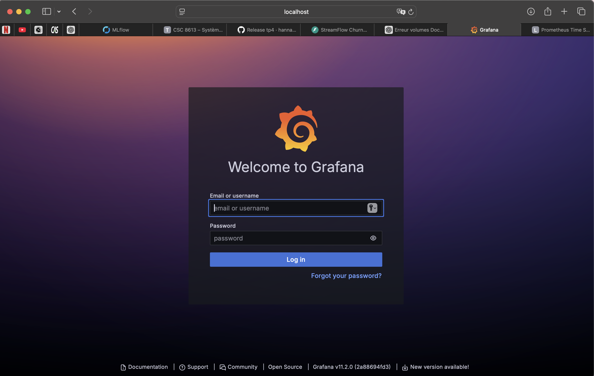
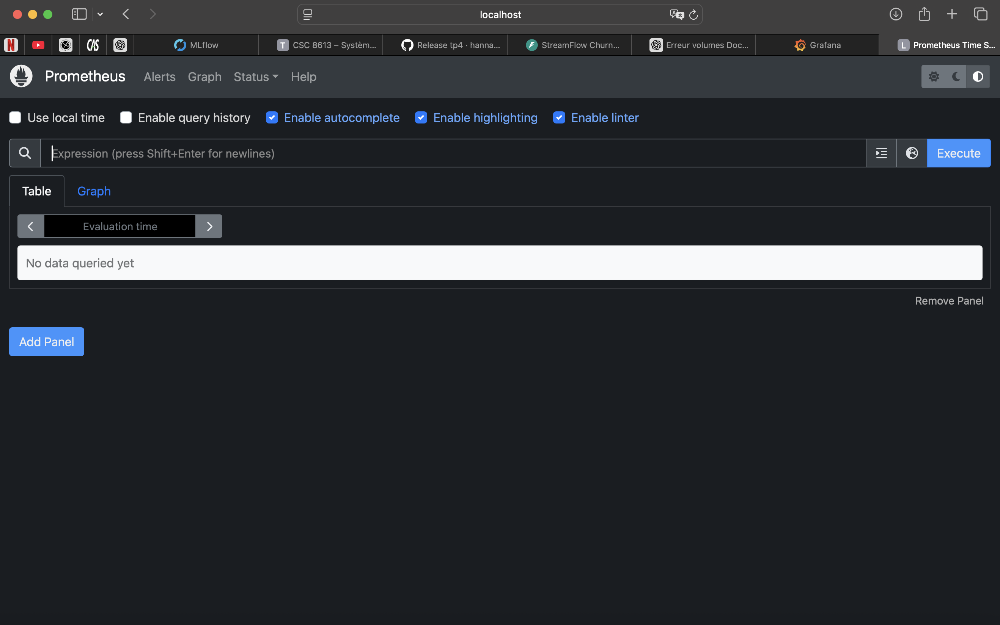
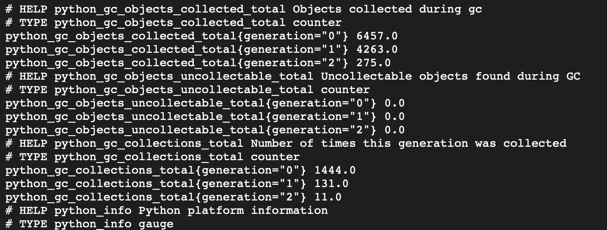
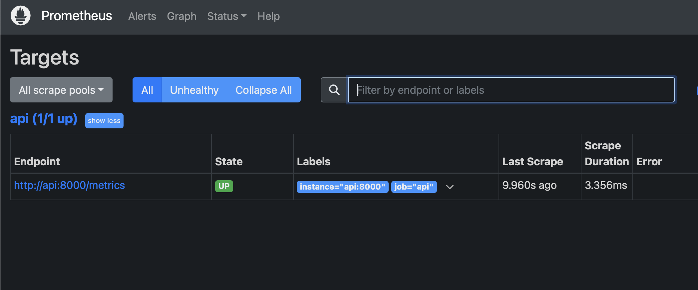
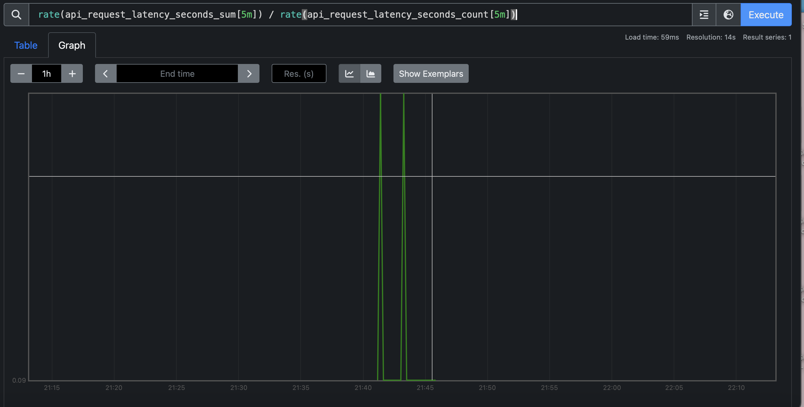
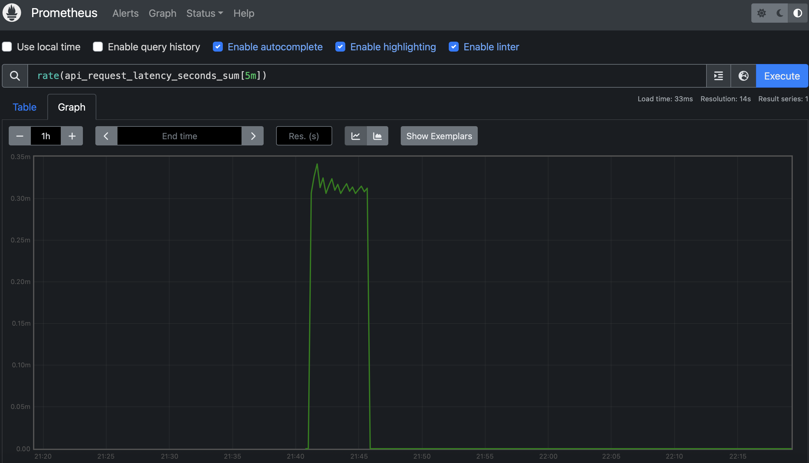
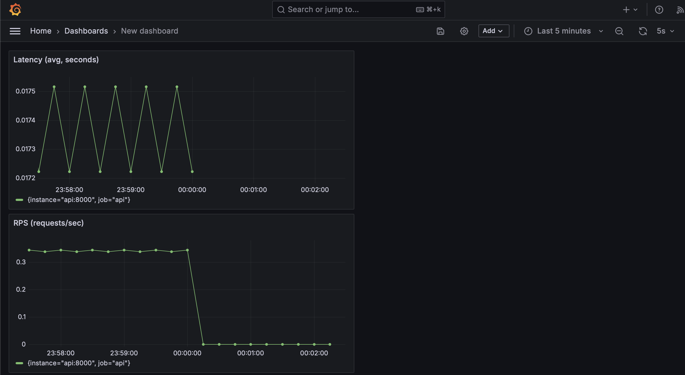
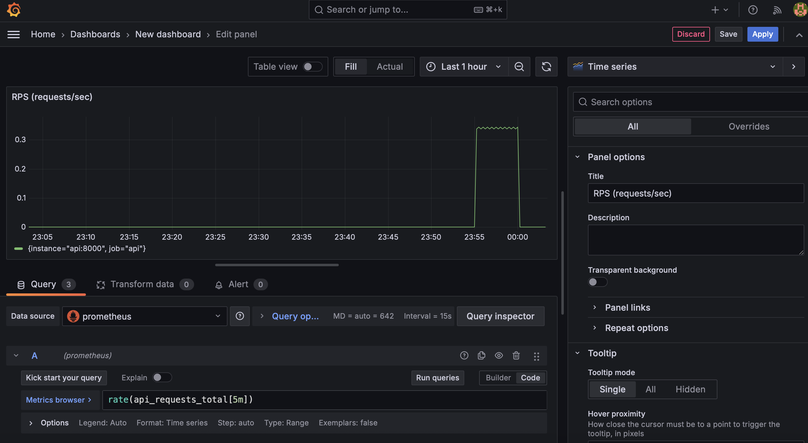
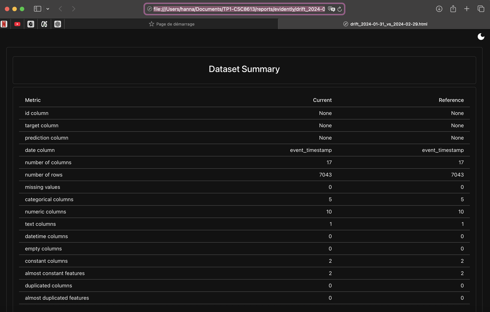

# Démarrer la stack pour l'observabilité

$ docker compose up -d --build
[+] Running 11/11
 ✔ Container tp1-csc8613-postgres-1  Running
 ✔ Container tp1-csc8613-mlflow-1    Started
 ✔ Container tp1-csc8613-feast-1     Started
 ✔ Container tp1-csc8613-prefect-1   Started
 ✔ Container tp1-csc8613-api-1       Started
 ✔ Container streamflow-prometheus   Started
 ✔ Container streamflow-grafana      Started

$ docker compose ps
NAME                     IMAGE                           SERVICE      STATUS                  PORTS
streamflow-grafana       grafana/grafana:11.2.0          grafana      Up                     0.0.0.0:3000->3000/tcp
streamflow-prometheus    prom/prometheus:v2.55.1         prometheus   Up                     0.0.0.0:9090->9090/tcp
tp1-csc8613-api-1        tp1-csc8613-api                 api          Up                     0.0.0.0:8000->8000/tcp
tp1-csc8613-mlflow-1     ghcr.io/mlflow/mlflow:v2.16.0   mlflow       Up                     0.0.0.0:5001->5000/tcp
tp1-csc8613-postgres-1   postgres:16                     postgres     Up                     0.0.0.0:5432->5432/tcp
tp1-csc8613-prefect-1    tp1-csc8613-prefect             prefect      Up
tp1-csc8613-feast-1      tp1-csc8613-feast               feast        Up

# Instrumentation de FastAPI avec de métriques Prometheus
extrait metrics:

Pourquoi un histogramme est plus utile qu’une moyenne de latence ? 
Une moyenne de latence peut masquer des problèmes : quelques requêtes très lentes (“outliers”) peuvent être invisibles si la majorité est rapide, ou au contraire gonfler la moyenne sans dire où se situent les lenteurs. Un histogramme donne la distribution (buckets) et permet d’estimer des percentiles (p95/p99), ce qui reflète beaucoup mieux l’expérience utilisateur. Il aide aussi à repérer rapidement une dégradation (plus de requêtes qui basculent vers des buckets élevés) même si la moyenne bouge peu.

# Exploration de Prometheus (Targets, Scrapes, PromQL)

Dans votre rapport reports/rapport_tp5.md, ajoutez :
Une capture d’écran de la page Status → Targets montrant la target de l’API en UP.

Une capture d’écran d’un graphe Prometheus correspondant à une requête PromQL 

Cette requête renvoie la latence moyenne des requêtes sur les 5 dernières minutes (en secondes), calculée à partir de l’histogramme en faisant le ratio entre le taux d’accumulation des durées (_sum) et le taux de requêtes (_count).

# Setup de Grafana Setup et création d'un dashboard minimal

Une capture d’écran du dashboard Grafana avec un pic de trafic visible.

Une capture d’écran de l’éditeur de requête d’un panel.

Un court texte (5–8 lignes) expliquant ce que ces métriques détectent bien, et ce qu’elles ne permettent pas de détecter (ex: qualité du modèle).

Les métriques RPS (rate(api_requests_total[5m])) et latence (rate(api_request_latency_seconds_sum[5m]) / rate(api_request_latency_seconds_count[5m])) permettent de détecter rapidement une dégradation “système” : montée en charge, augmentation de trafic, ralentissements, timeouts potentiels, ou instabilité liée à l’infrastructure (CPU/IO/DB/online store). Elles aident aussi à vérifier que l’API est effectivement appelée et que Prometheus scrape correctement l’endpoint /metrics. En revanche, ces métriques ne donnent aucune information directe sur la qualité ML : elles ne détectent pas une baisse d’AUC/F1 en production, ni un drift qui dégrade la performance, ni des prédictions incohérentes “sémantiquement” tant que l’API répond. Elles ne disent pas non plus si les features sont “justes” (ex : valeurs stale), seulement si elles sont présentes et que la requête aboutit.

# Drift Detection with Evidently (Month_000 vs Month_001)

 Dans votre rapport reports/rapport_tp5.md, ajoutez :
Une capture d’écran du rapport Evidently (HTML) ou d’une section clé montrant la comparaison ref vs current.

Une réponse courte : différence entre covariate drift et target drift dans ce projet.

Différence covariate drift vs target drift (court)
Covariate drift : la distribution des features d’entrée change entre month_000 et month_001 (ex : monthly_fee, watch_hours, etc.). Ça peut dégrader le modèle même si l’API tourne correctement.
Target drift : la distribution de la cible (ici churn_label, donc le taux de churn) change entre les périodes. Ça indique souvent un changement “métier” (comportements clients) et peut nécessiter un réentraînement / recalibrage.
 
Le copier/coller de la ligne de décision finale imprimée par le script.

[Evidently] report_html=/reports/evidently/drift_2024-01-31_vs_2024-02-29.html report_json=/reports/evidently/drift_2024-01-31_vs_2024-02-29.json drift_share=0.06 -> NO_ACTION drift_share=0.06 < 0.30 (target_drift=0.0)
