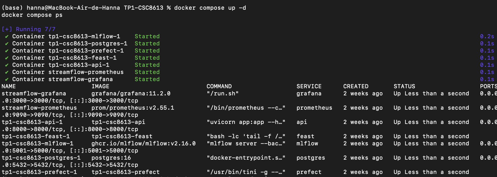
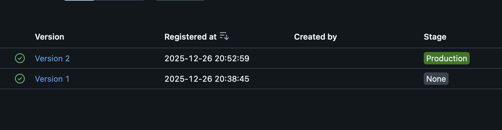
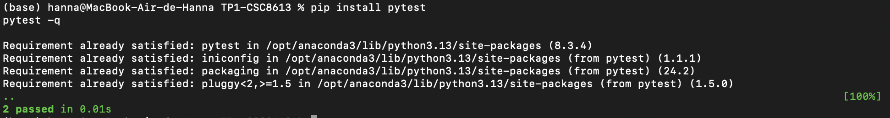
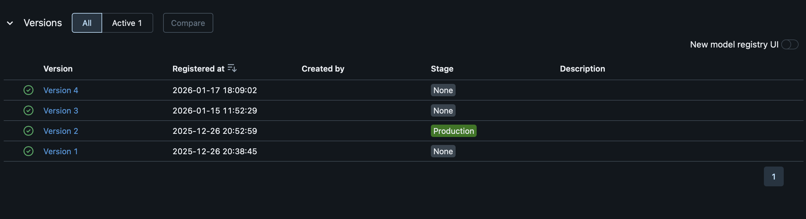
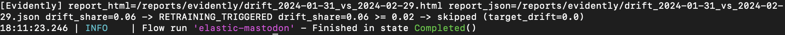
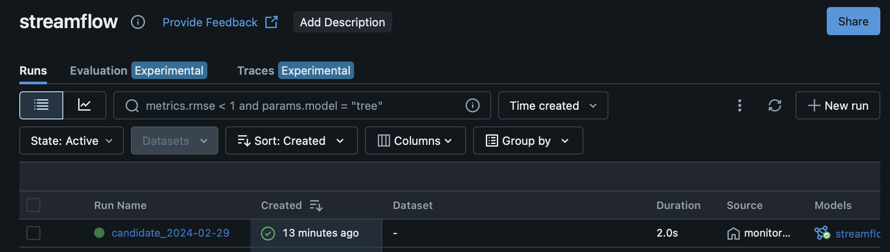
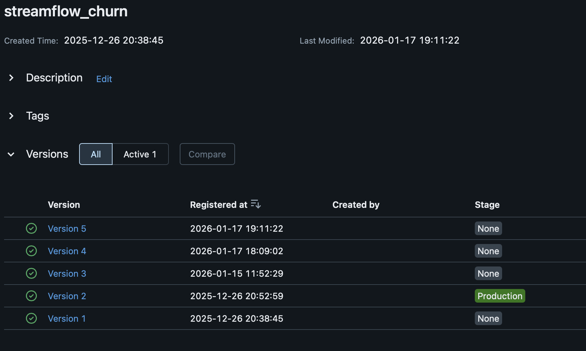
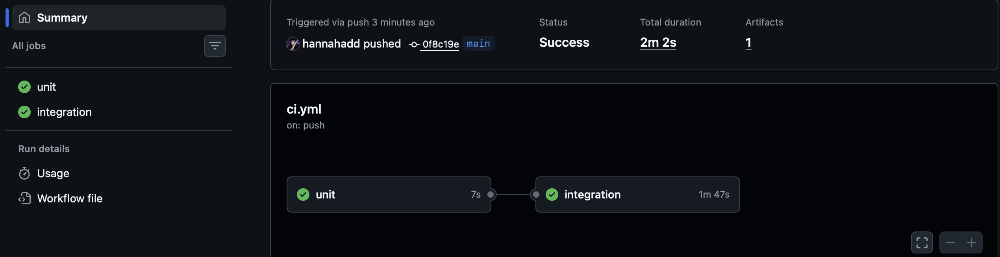

## Exercice 1




## Exercice 2



On extrait une fonction “pure” (sans I/O, sans dépendances Prefect/MLflow) pour pouvoir la tester rapidement, de façon déterministe, et isoler la logique de décision du reste du système.

## Exercice 3

Un transcript des logs du flow (au minimum les lignes [COMPARE] et [SUMMARY])

17:09:02.831 | INFO    | Task run 'evaluate_production-14e' - Finished in state Completed()
[COMPARE] candidate_auc=0.6392 vs prod_auc=0.9499 (delta=0.0100)
[DECISION] skipped
17:09:02.849 | INFO    | Task run 'compare_and_promote-b57' - Finished in state Completed()
[SUMMARY] as_of=2024-02-29 cand_v=4 cand_auc=0.6392 prod_v=2 prod_auc=0.9499 -> skipped
17:09:02.861 | INFO    | Flow run 'orchid-koel' - Finished in state Completed()

Une capture MLflow montrant le résultat (Production promu ou non)

Dans MLflow, une nouvelle version du modèle a bien été enregistrée, mais l’ancienne reste en Production: la nouvelle n’atteint pas le seuil requis, avec un AUC de 0,6, inférieur à 0,9391 + delta.




Une phrase expliquant pourquoi on utilise un delta:
On ajoute un delta pour ne promouvoir le modèle que si l’AUC progresse de façon réellement significative, et pas juste à la marge par rapport à l’actuelle.

## Exercice 4



[Evidently] report_html=/reports/evidently/drift_2024-01-31_vs_2024-02-29.html report_json=/reports/evidently/drift_2024-01-31_vs_2024-02-29.json drift_share=0.06 -> RETRAINING_TRIGGERED drift_share=0.06 >= 0.02 -> skipped (target_drift=0.0)
18:11:23.246 | INFO    | Flow run 'elastic-mastodon' - Finished in state Completed()

Le monitoring Evidently a relevé un drift (drift_share=0,06) ; comme il dépasse le seuil de 0,02, il a automatiquement lancé train_and_compare_flow(as_of=2024-02-29), mais malgré le retraining, l’AUC n’apportait pas de gain suffisant : promotion refusée (skipped) et modèle en Production inchangé.






## Exercice 5

Un transcript curl montrant la réponse JSON
```

(base) hanna@MacBook-Air-de-Hanna TP1-CSC8613 %                                         
curl -s -X POST "http://localhost:8000/predict" \
  -H "Content-Type: application/json" \
  -d '{"user_id":"7590-VHVEG"}' | jq  
{
  "user_id": "7590-VHVEG",
  "prediction": 1,
  "features_used": {
    "paperless_billing": true,
    "plan_stream_tv": false,
    "months_active": 1,
    "net_service": "DSL",
    "monthly_fee": 29.850000381469727,
    "plan_stream_movies": false,
    "skips_7d": 4,
    "rebuffer_events_7d": 1,
    "watch_hours_30d": 24.48365020751953,
    "unique_devices_30d": 3,
    "avg_session_mins_7d": 29.14104461669922,
    "failed_payments_90d": 1,
    "ticket_avg_resolution_hrs_90d": 16.0,
    "support_tickets_90d": 0
  }
}
``` 

Une phrase expliquant pourquoi l’API doit être redémarrée
L’API charge le modèle MLflow au démarrage (models:/streamflow_churn/Production). Après une promotion dans le Model Registry, l’API ne recharge pas automatiquement le modèle déjà en mémoire : il faut donc redémarrer le service pour qu’il récupère la nouvelle version Production.

## Exercice 6

Une capture GitHub Actions montrant un run qui passe


Une phrase expliquant pourquoi on démarre Docker Compose dans la CI (tests d’intégration multi-services)

On démarre Docker Compose dans la CI pour lancer la stack complète et vérifier que tous les services s’assemblent correctement entre eux, notamment que l’API démarre bien et répond au healthcheck dans un environnement proche du réel.

## Exercice 7

### Q7.a 

Dans ce TP, on met en place une boucle complète : surveiller les données, déclencher un réentraînement si besoin, comparer au modèle en production et, éventuellement, promouvoir une nouvelle version, puis la servir via l’API. Le drift est mesuré avec Evidently en comparant month_000 (référence) à month_001 (courant). L’indicateur drift_share représente la proportion de variables dont la distribution a suffisamment changé entre les deux périodes. Si drift_share dépasse 0.02, on déclenche un réentraînement ; ce seuil est volontairement bas pour le TP, mais serait en général plus élevé en production.

Quand le retrain est déclenché, train_and_compare_flow reconstruit le dataset du mois courant via Feast et les labels, entraîne un modèle candidat et logge ses métriques dans MLflow, notamment val_auc. Le flow évalue aussi le modèle déjà en Production sur le même split afin d’obtenir un prod_auc comparable. La promotion suit une règle simple : le candidat est promu seulement si son AUC dépasse celle de la Production d’au moins un delta (new_auc > prod_auc + delta). Sinon, la Production reste inchangée et la version candidate demeure au stage “None” dans le registry.

Prefect orchestre toute la logique MLOps (monitoring, décision, réentraînement, comparaison et promotion dans MLflow). GitHub Actions assure la CI : exécution des tests unitaires et smoke test en lançant la stack via Docker Compose puis en vérifiant que l’API répond à /health.


### Q7.b

La CI ne doit pas lancer un entraînement complet car c’est coûteux, lent et souvent non déterministe, ce qui rend les runs instables et difficiles à reproduire. En CI, l’objectif est plutôt de valider rapidement que le code s’exécute, que les services démarrent et que les contrats d’API tiennent, pas d’optimiser un modèle.

Il manque généralement des tests d’intégration plus fins, par exemple des tests d’API sur /predict avec des cas réels, des tests de schéma et de qualité de données, des tests de compatibilité Feast/MLflow, des tests de régression sur les métriques et des garde-fous sur le drift pour éviter les faux positifs.

En conditions réelles, une approbation humaine reste souvent nécessaire car promouvoir un modèle a des impacts métier et réglementaires. On attend des validations sur la performance par segment, l’équité, la robustesse, la traçabilité, ainsi qu’une gouvernance claire sur qui peut promouvoir, quand, et avec quelles preuves, surtout si le modèle influence des décisions sensibles.


Q7.c